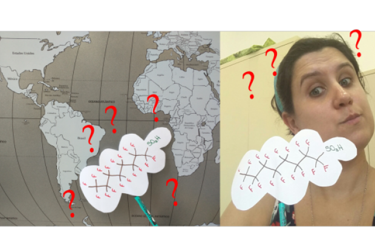
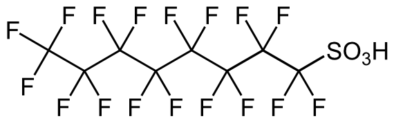
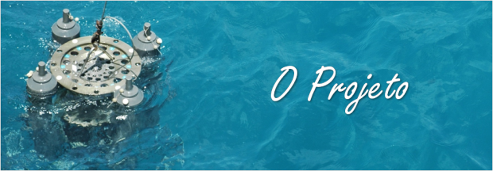
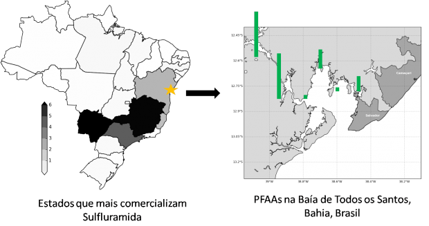
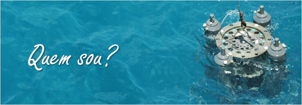

 

O PFOS (Ácido Perfluorooctano Sulfônico) faz parte do grupo das substâncias perfluoralquilsulfonadas (PFAAs).
É um composto altamente persistente e responsável por diversos efeitos adversos na biota e nos seres humanos:
desde problemas hormonais e hepáticos até câncer.
A maior parte dos trabalhos realizados no mundo sobre PFOS esta relacionado ao seu uso na indústria.
No entanto, o PFOS também é um produto base da produção de um praguicida amplamente utilizado no Brasil e um dos seus produtos de degradação:
a Sulfluramida, que é utilizada pra combater formigas de corte.

 

 

Devido as suas propriedades físico-químicas e sua alta toxicidade o PFOS faz parte do grupo dos Poluentes Orgânicos Persistentes e sua produção e uso é regulado pela Convenção de Estocolmo.
Os países signatários da Convenção de Estocolmo são responsáveis,
não somente, pela restrição do uso desse composto,
mas também pelo monitoramento ambiental a fim de identificar se as medidas restritivas estão sendo efetivas.
O Brasil faz parte da Convenção de Estocolmo e hoje possui uma autorização para continuar usando o PFOS para a manufatura da Sulfluramida,
visto que até o momento não foram encontrados substitutos adequados para esse praguicida.

 

O Brasil não só é um grande usuário da Sulfluramida como também é um importante produtor e exportador.
No entanto, são raros os estudos que citam a sua ligação aos PFOS e/ou estudos de ocorrência de PFOS em amostras ambientais do Brasil.
Alguns estudos ([http://pubs.acs.org/doi/abs/10.1021/es300578x](http://pubs.acs.org/doi/abs/10.1021/es300578x) e [http://pubs.acs.org/doi/abs/10.1021/es503490z](http://pubs.acs.org/doi/abs/10.1021/es503490z)) já mostraram que esse composto esta amplamente distribuído no nosso mar (desde o Rio Grande do Sul até a Amazônia).
Dessa forma, nosso maior objetivo é responder a pergunta:

 

**Seria a Sulfluramida uma fonte significante de PFOS para a costa brasileira?**

 

**Ajude-nos a responder essa pergunta e com os dados gerados dar subisídios para que os órgãos ambientais possam proibir o uso, a produção e a venda da Sulfluramida no Brasil.**

 

 

Começamos nosso projeto avaliando a ocorrência de PFOS e outros produtos de degradação da Sulfluramida em águas superficiais da Baía de Todos os Santos.
Afinal de contas, a Bahia esta entre os 4 estados que mais comercializam a Sulfluramida e as águas da Baía de Todos os Santos tem conexão direta com o Oceano Atlântico.

 

 

Na segunda parte do projeto,
vamos analisar amostras de água superficial e sedimento de 5 rios que deságuam na Baía de Todos os Santos para avaliar e quantificar os fluxos de PFOS.
Além disso, também analisaremos amostras do extremo Sul da Bahia (Complexo Estuarino de Caravelas e Nova Viçosa),
pois nessas regiões encontram-se extensas plantações de eucaliptos que é a cultura onde a Sulfluramida mais é utilizada.
Vale lembrar que o Complexo Estuarino de Caravelas e Nova Viçosa fica em frente a Parque Nacional Marinho dos Abrolhos que,
além de abrigar exuberantes formações de corais,
é também a região de reprodução da baleia Jubarte.

 

*Ajudando a financiar esse projeto você estará viabilizando:*

- *pagamento de embarcação e material para coletas em 4 rios da Baía de Todos os Santos (Rio Paraguaçu, Rio Subaé, Rio Mataripe e Rio São Paulo);*
- *pagamento de embarcação e material coletas no Complexo Estuarino Caravelas-Nova Viçosa;*
- *compra de material para realização das analises de PFOS: cartuchos de extração, solventes e reagentes.*

 

 

Sou oceanóloga formada pela Universidade Federal de Rio Grande e com doutorado em Oceanografia Química pela Universidade de São Paulo. Há um ano e meio sou professora adjunta do Departamento de Oceanografia da Universidade Federal da Bahia e venho lutando contra a maré de cortes orçamentários que resultaram nas dificuldades hoje enfrentadas pela ciência no Brasil.

 

No cenário atual vejo duas opções: ou paro as minhas pesquisas ou acho formas criativas de mantê-las. Optei pela segunda, porque sou brasileira e não desisto nunca! ;)

 

\* se refere a um oceano livre de qualquer composto sintético, um trocadilho com o termo "alimentos orgânicos"
